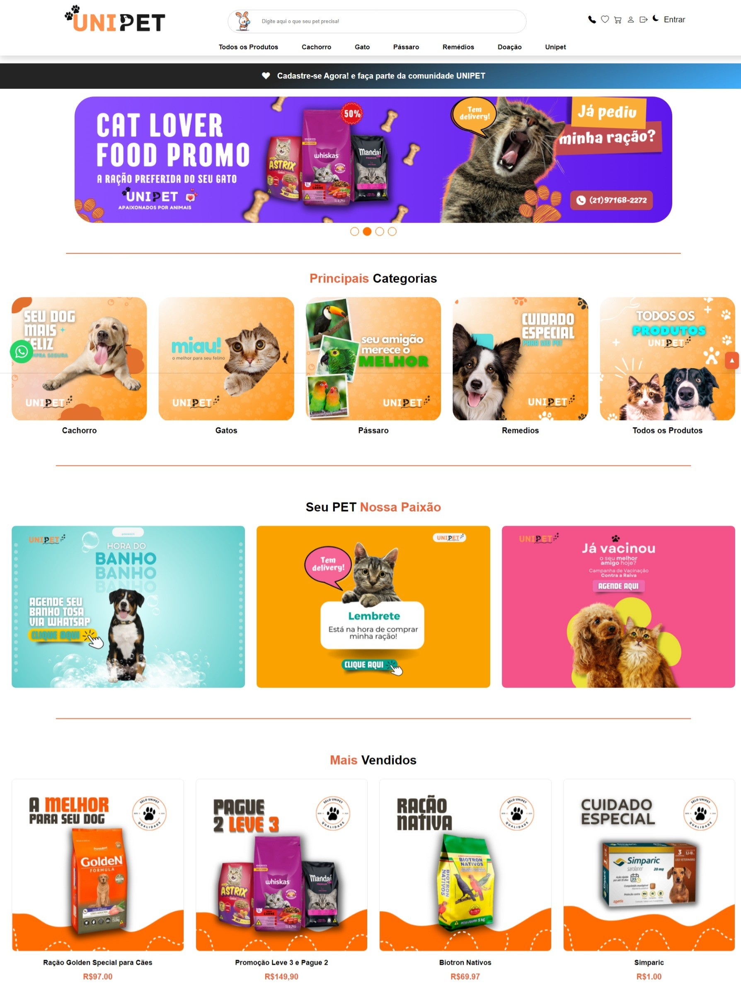
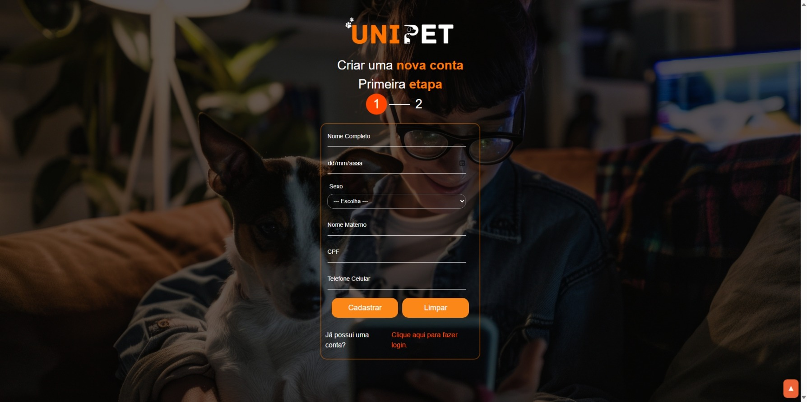
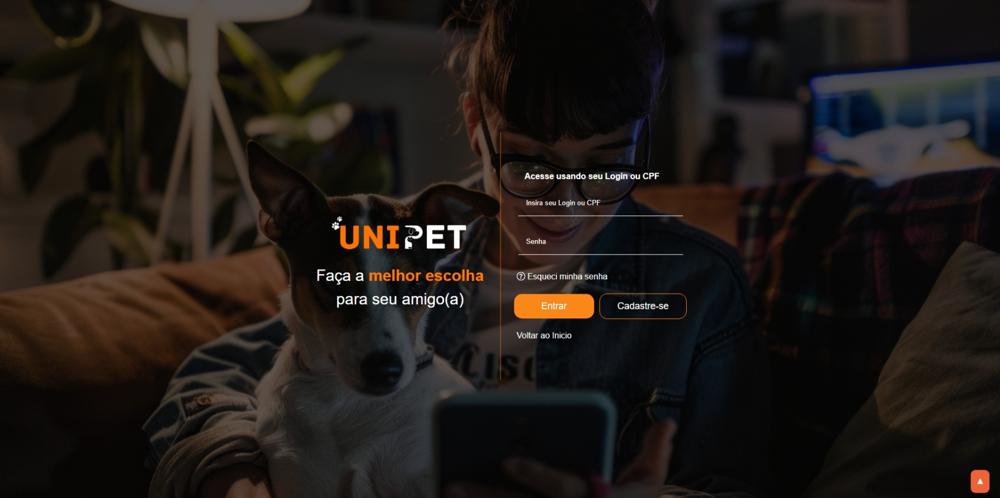
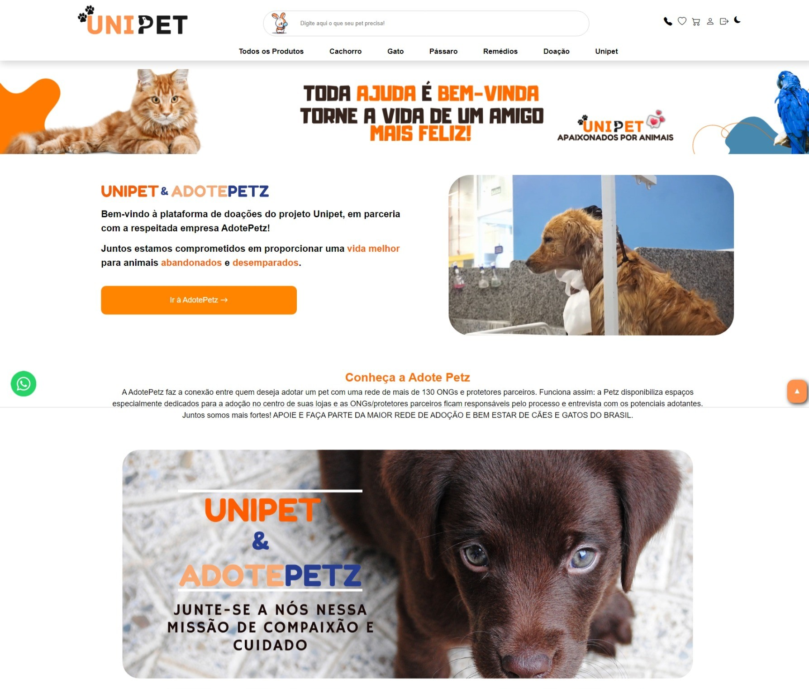

# 🐾 Projeto Unipet

**Sistema para Petshop e Adoção de Animais**

[]()
[]()
[]()

## 📖 Visão Geral

O **Projeto Unipet** é uma aplicação web desenvolvida para gerenciar um petshop que vende produtos relacionados a animais e conecta usuários a locais de adoção. O sistema também oferece funcionalidades para o cadastro e consulta de clientes, controle de estoque e gerenciamento de dados de adoção.

🔗 **Demonstração (Frontend):** [Visualizar aplicação no GitHub Pages](https://unipet-projeto.infinityfreeapp.com/public/index.php)

---

## ✨ Funcionalidades Principais

* **🛒 Loja Virtual:**
    * Catálogo de produtos relacionados a animais.
    * Controle de estoque e carrinho de compras.
* **🐶 Adoção de Animais:**
    * Integração com ONGs e locais de adoção.
* **👤 Gerenciamento de Usuários:**
    * Perfis de acesso para administradores e clientes.
    * Cadastro, consulta, alteração e exclusão de usuários.
* **🔐 Autenticação Segura:**
    * Login com verificação em dois fatores (2FA).
* **📊 Relatórios e Logs:**
    * Registro de operações e exportação de relatórios em PDF.
* **♿ Acessibilidade:**
    * Troca de contraste e ajuste de tamanho de fonte para maior inclusão.

---

## 📂 Estrutura de Pastas (MVC)

Para manter o projeto organizado, siga rigorosamente esta estrutura ao criar novos arquivos:

```text
/
├── app/                  # Lógica do Backend (Invisível ao usuário)
│   ├── actions/          # Scripts que processam formulários (login, salvar produto)
│   ├── config/           # Conexão com banco de dados
│   └── includes/         # Arquivos reutilizáveis (Header, Footer, Functions)
│
├── assets/               # Arquivos Estáticos (CSS, JS, Imagens)
│   ├── css/              # Estilos organizados por módulo (admin, cliente, global)
│   ├── img/              # Imagens do layout e uploads de produtos
│   └── js/               # Scripts JavaScript
│
├── migrations/           # Scripts SQL para criar/atualizar o banco de dados
│
└── public/               # Páginas visíveis ao usuário (Frontend)
    ├── index.php         # Página inicial
    ├── auth/             # Login, Registro, Recuperação de Senha
    ├── admin/            # Painel Administrativo (Protegido)
    └── cliente/          # Área do Cliente (Protegida)

```

---

## 🚀 Como Rodar o Projeto

### Pré-requisitos

* [XAMPP](https://www.apachefriends.org/) (ou qualquer servidor Apache + MySQL).
* Git.

### Passo a Passo

1. **Clone o repositório** dentro da pasta `htdocs`:
```bash
git clone [https://github.com/Jvictorj/unipet-petshop-website.git]
```

2. **Configure o Banco de Dados:**
* Abra o phpMyAdmin (`http://localhost/phpmyadmin`).
* Crie um banco chamado `unipet`.
* Importe o arquivo localizado em: `migrations/001_criacao_banco_inicial.sql`.

3. **Acesse o Projeto:**
* Abra o navegador e digite: `http://localhost/unipet-petshop-website/public/index.php`

---

## 📸 Capturas de Tela

> *Nota: As imagens abaixo são demonstrativas.*

### Página Inicial
  
*Visão geral do catálogo de produtos e opções de adoção.*

### Cadastro de Usuário
  
*Formulário para novos clientes realizarem seu cadastro.*

### Tela de Login com 2FA
  
*Autenticação segura com dois fatores.*

### Consulta de Animais para Adoção 
  
*Lista de animais disponíveis para adoção, integrados a ONGs parceiras.*

---

## 🛠️ Tecnologias Utilizadas

* **Back-end:** PHP 8+
* **Banco de Dados:** MySQL
* **Front-end:** HTML5, CSS3, JavaScript (Vanilla)

---

## 🤝 Contribuindo com o Projeto

Contribuições são bem-vindas! Siga o fluxo abaixo:

1. Abra uma **Issue** relatando o problema ou sugestão.
2. Faça um **Fork** do projeto.
3. Crie uma branch para sua feature:
```bash
git checkout -b feature/nova-funcionalidade
```

### Commits Semânticos

Por favor, siga este padrão nas mensagens de commit:

* `feat`: Nova funcionalidade.
* `fix`: Correção de bug.
* `refactor`: Mudança de código ou pasta sem alterar funcionalidade.
* `style`: Mudanças de CSS/Design.
* `docs`: Alterações na documentação.

---

## 🗄️ Banco de Dados

Os scripts de criação e atualização do banco estão na pasta `migrations/`.

> **Instalação:** Para instalar o banco do zero, execute o script:
> `migrations/001_criacao_banco_inicial.sql`
